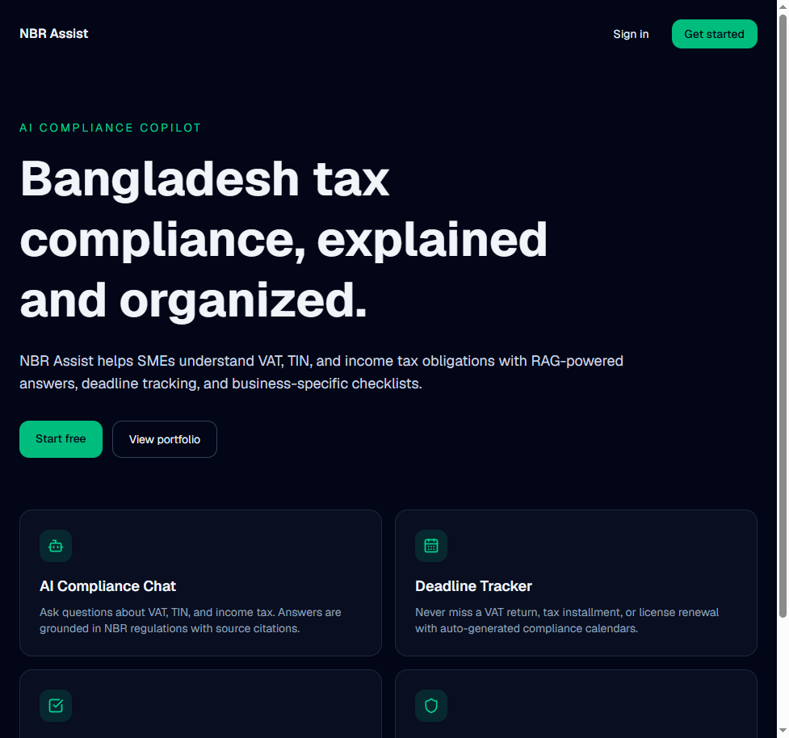
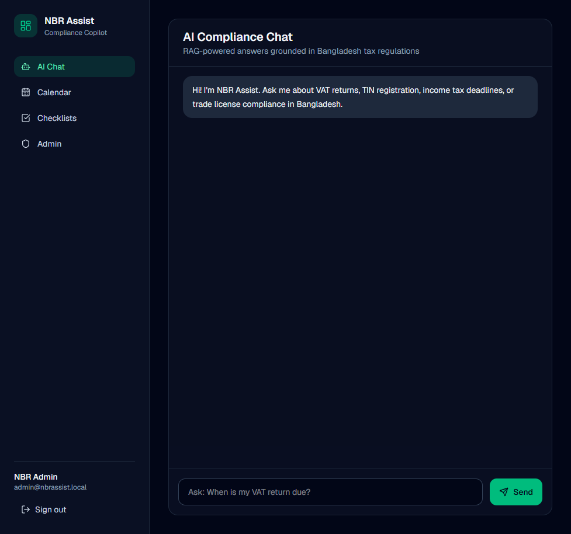
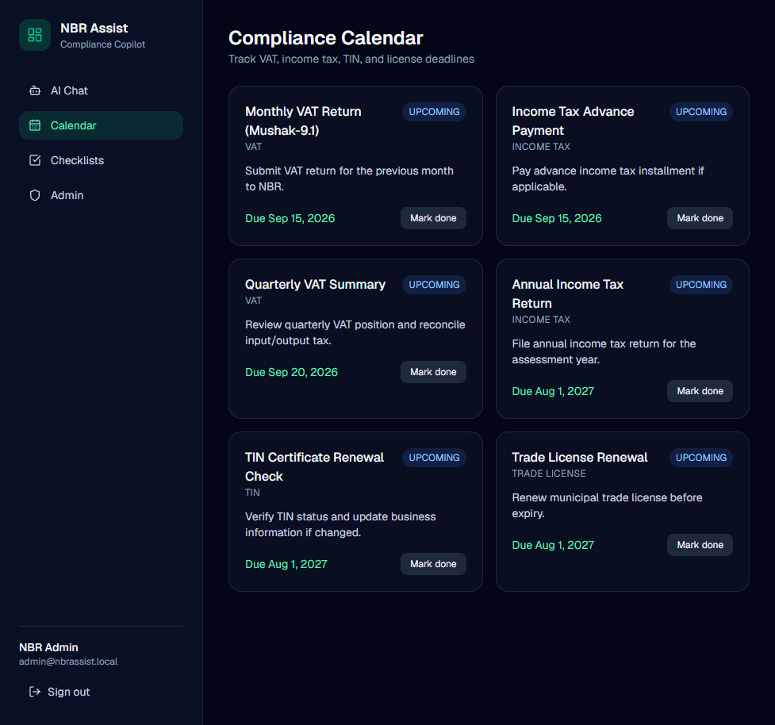

# NBR Assist — AI Compliance Copilot

[](https://nbr-assist.vercel.app)
[](https://nextjs.org/)
[](https://neon.tech)
[](https://ai.google.dev/)

**Live demo:** [https://nbr-assist.vercel.app](https://nbr-assist.vercel.app)  
**Case study:** [docs/CASE_STUDY.md](docs/CASE_STUDY.md)

AI-powered compliance assistant for Bangladeshi SMEs. Ask questions about VAT, TIN, and income tax with **RAG-grounded answers**, track deadlines, and generate business-specific checklists.

Built as a portfolio project demonstrating **Next.js 16, TypeScript, PostgreSQL, Prisma, JWT auth, and Google Gemini RAG**.

## Screenshots

| Landing | AI Chat | Compliance Calendar |
|---------|---------|---------------------|
|  |  |  |

## Features

- **AI Compliance Chat** — RAG pipeline with regulation citations
- **Compliance Calendar** — VAT, income tax, TIN, and trade license deadlines
- **Business Checklists** — Retail, restaurant, freelancer, export templates
- **Admin Panel** — Upload and ingest NBR regulation documents
- **Auth & RBAC** — JWT sessions with Admin / Business Owner roles

## Tech Stack

| Layer | Technology |
|-------|------------|
| Frontend | Next.js 16, React 19, TypeScript, Tailwind CSS 4 |
| Backend | Next.js API Routes |
| Database | PostgreSQL (Neon), Prisma ORM |
| AI | Google Gemini (chat + embeddings) |
| Auth | JWT (httpOnly cookies), bcrypt |
| Hosting | Vercel + Neon |

## Try the live demo

1. Open [https://nbr-assist.vercel.app](https://nbr-assist.vercel.app)
2. Sign in with the **public demo** account:

| Role | Email | Password |
|------|-------|----------|
| Business Owner (public) | `owner@nbrassist.local` | `Demo@NBR2026!` |

Admin credentials are private (set via `DEMO_ADMIN_PASSWORD` when seeding). See [docs/DEPLOYMENT.md](docs/DEPLOYMENT.md).

## Quick Start (local)

### 1. Clone and install

```bash
git clone https://github.com/NazmusSakib3/nbr-assist.git
cd nbr-assist
npm install
```

### 2. Configure environment

```bash
cp .env.example .env
```

Edit `.env`:

- `DATABASE_URL` — PostgreSQL connection string
- `JWT_SECRET` — random 32+ char secret
- `GEMINI_API_KEY` — from [Google AI Studio](https://aistudio.google.com/apikey)

### 3. Start PostgreSQL

```bash
docker compose up -d
```

### 4. Run migrations and seed

```bash
npm run db:push
npm run db:seed
```

### 5. Start dev server

```bash
npm run dev
```

Open [http://localhost:3000](http://localhost:3000)

## Project Structure

```text
src/
  app/
    (dashboard)/     # Chat, calendar, checklists, admin
    api/             # Auth, chat, calendar, checklists, admin
  components/        # UI panels
  lib/
    ai/              # Gemini, RAG, chunking
    compliance/      # Deadlines, checklist templates
    auth.ts
    prisma.ts
prisma/
  schema.prisma
  seed.ts
```

## RAG Pipeline

1. Admin uploads regulation text
2. Content is chunked (~900 chars, 120 overlap)
3. Each chunk is embedded via Gemini
4. User question is embedded and matched by cosine similarity
5. Top chunks are passed to Gemini chat with citations

## API Overview

| Endpoint | Method | Description |
|----------|--------|-------------|
| `/api/auth/register` | POST | Create account |
| `/api/auth/login` | POST | Sign in |
| `/api/chat` | POST | RAG chat message |
| `/api/calendar` | GET/PATCH | Compliance deadlines |
| `/api/checklists` | GET/POST/PATCH | Business checklists |
| `/api/admin/documents` | GET/POST | Regulation library (admin) |

## Portfolio Highlights

- End-to-end product with auth, AI, and admin workflows
- RAG with source citations (not a generic ChatGPT wrapper)
- Domain-specific: Bangladesh tax & compliance
- Production patterns: JWT, RBAC, Prisma, Docker, typed APIs
- Live on Vercel with Neon Postgres

## Deployment

See [docs/DEPLOYMENT.md](docs/DEPLOYMENT.md) for **Vercel + Neon** setup.

Quick summary:
1. Create free Postgres on [Neon](https://neon.tech)
2. Push repo to GitHub
3. Import to [Vercel](https://vercel.com/new) and set env vars
4. Run `npm run db:seed` once against production DB

## License

MIT
